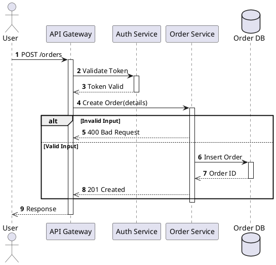

# Logic Sequence Mapper

## Overview

This skill helps you explore a codebase, index its structure, trace execution paths, and visualize the logic using PlantUML sequence diagrams. It is designed to turn complex code into clear, visual documentation.

## Workflow

### Phase 1: Indexing & Exploration

Before generating diagrams, you must understand the code structure.

1.  **Identify Entry Points**:
    *   Look for API route definitions (e.g., controllers, views).
    *   Find CLI command handlers.
    *   Locate event listeners or background job triggers.
    *   *Action*: Use `grep` or `search` to find these patterns.

2.  **Trace Execution Paths**:
    *   Start from an entry point and follow the function calls depth-first.
    *   Identify key components: Services, Repositories, Helpers, External APIs.
    *   *Action*: Read relevant files. If the call chain is deep, maintain a mental or scratchpad list of the stack.

3.  **Symbol Indexing**:
    *   Note down the class/module names and their responsibilities.
    *   Identify the main data structures passed between components.

### Phase 2: Sequence Mapping

Translate the traced path into a logical sequence.

1.  **Define Participants**:
    *   **Actor**: User or external system triggering the flow.
    *   **Boundary**: API Endpoint, UI Controller, CLI Interface.
    *   **Control**: Business Logic Services, Managers, Handlers.
    *   **Entity**: Data Models, Database access layers.
    *   **Database**: The actual database storage.

2.  **Structure the Interaction**:
    *   Represent function calls as synchronous messages (`->`).
    *   Represent return values as dashed arrows (`-->>`).
    *   Represent async messages/events as open arrows (`->>`).

3.  **Handle Logic Flow**:
    *   **Alt/Else**: Use for `if/else` logic (e.g., validation failure, error handling).
    *   **Loop**: Use for iterations.
    *   **Opt**: Use for optional steps.

### Phase 3: PlantUML Generation

Generate the PlantUML code.

1.  **Syntax Rules**:
    *   Start with `@startuml` and end with `@enduml`.
    *   Use `autonumber` for step counting.
    *   Use `box "ComponentName" #LightBlue` to group related participants.

2.  **Commenting**:
    *   Add comments (`note right of ...`) to explain complex logic or business rules that aren't obvious from the method names.

3.  **Output**:
    *   Provide the raw PlantUML code in a code block.

## Example Output

## Tips for Success

*   **Be Selective**: Don't map every single utility function call (like `logger.info` or string formatting) unless relevant to the core logic. Focus on architectural boundaries and business decisions.
*   **Abstraction Level**: Keep the diagram at a consistent level of abstraction. Don't mix high-level system interactions with low-level variable assignments.
*   **Verification**: After generating the PlantUML, verify it against the code one last time to ensure no critical steps were missed.
