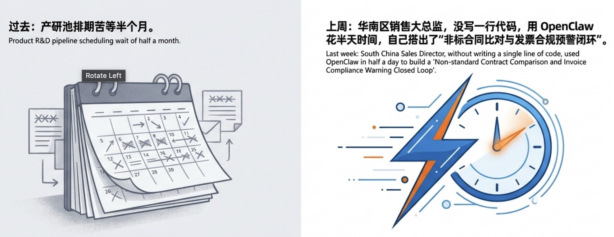
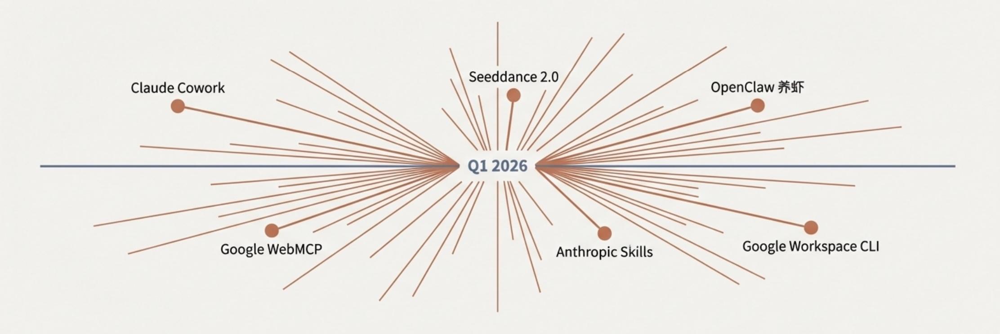
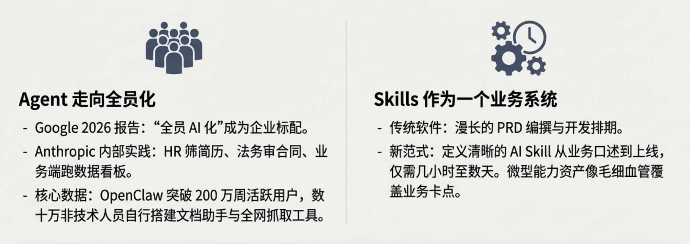
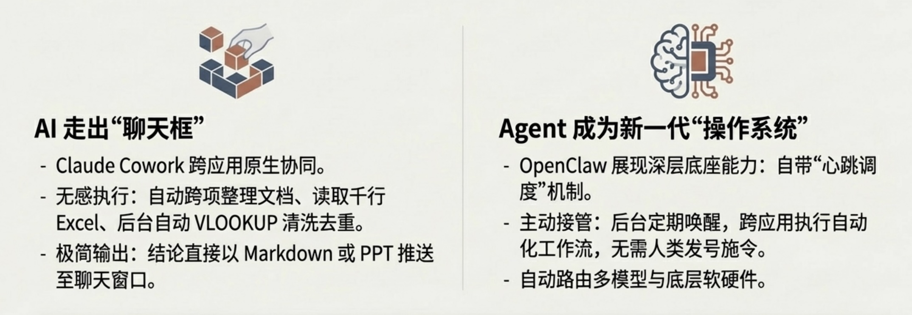
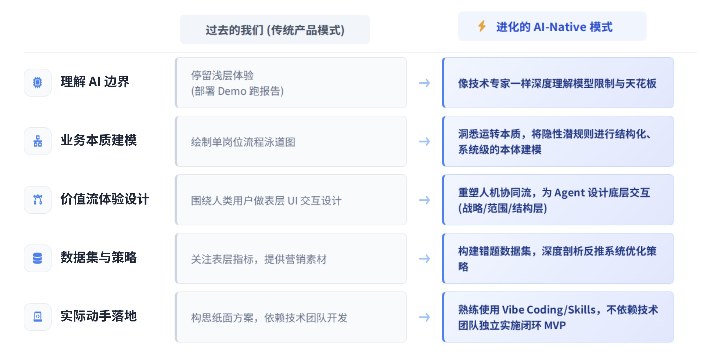
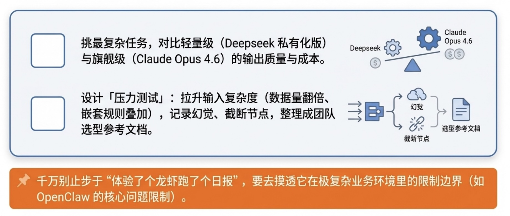
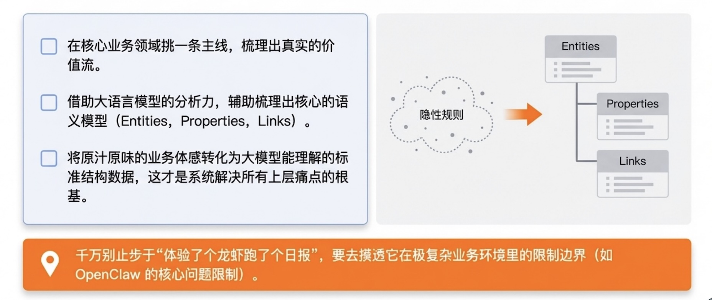
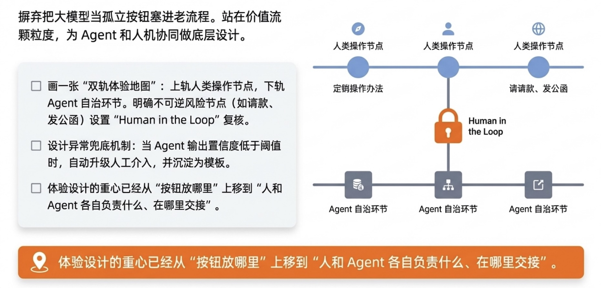
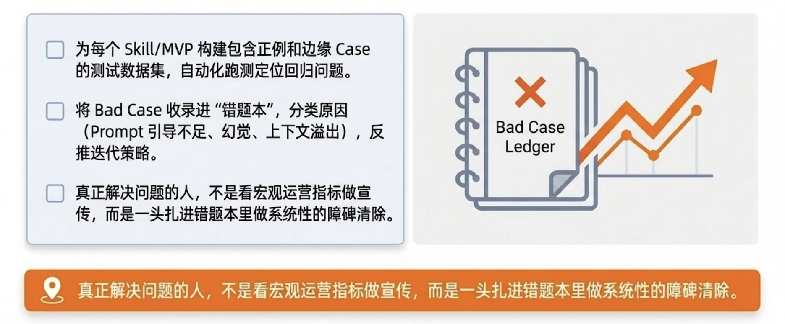
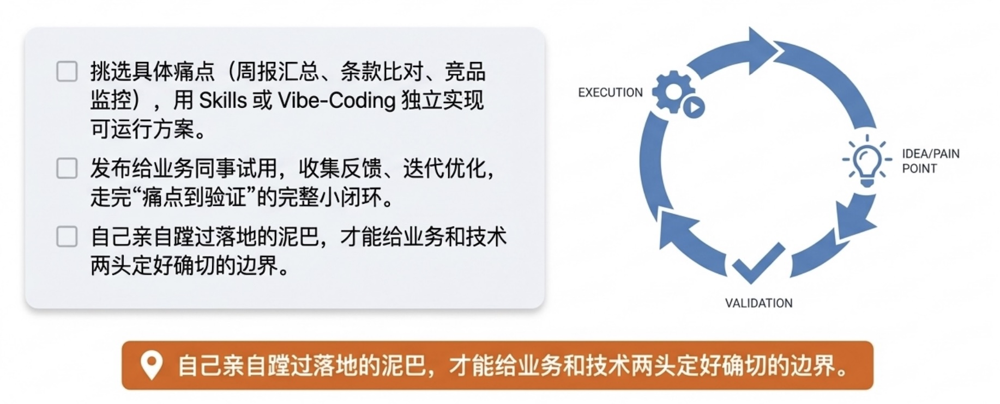

> 上周，负责华南区销售的大业务总监，拿着一个他自己用 OpenClaw 花半天时间搭出来的自动化跑批工具来找我。原本在产研池子里需要排期苦等半个月的“非标合同比对与发票合规预警闭环”，被他这个从没写过一行代码的老业务直接打通了。看着业务人员在终端里行云流水般的操作，作为产品经理，不由开始深思：过去，“写需求、催排期、盯交付”的是产品经理的核心工作；现在呢？如果这些不再是壁垒，产品经理的核心价值到底是什么？

## 1 Agent加速进化：4 个新趋势

### 变化1：Agent的设计和应用，走向全员化
> - Google 2026 AI Agent 趋势报告，“全员 AI 化”正成为企业标配，非技术职能使用 AI 的深度显著增加。
> - Anthropic 曾公开分享其内部实践：HR 用于批量筛选简历、法务用于合同初审降低风险、部分业务端更借助 Claude Code 自主生成数据看板。
> - OpenClaw龙虾从专业开发者走向非技术用户：目前它拥有高达 200 万的系统周活跃用户，并且有数十万非技术人员正在用它搭建个人的私人文档助手、自动汇总未读邮件或是定点全网抓取竞品价格；这侧面体现了 Agent向大众群体的快速扩散。

**思考**：
当最熟悉业务痛点的一线人员，能够借助 AI 自行搭建自动化流程和脚本时，传统基于信息差建立的“懂业务但不懂技术”的沟通壁垒便被打破了。产品经理过去的核心定位之一是作为业务和技术之间的沟通桥梁，那现在这个空间是不是进一步被压缩了？

### 变化2：自然语言驱动的Skills，可以作为一个业务系统
> - 传统软件功能依赖漫长的 PRD 编撰与开发排期。而在实际的企业落地中，一个定义清晰的 AI Skill，从业务口述真实边界到技术跑通上线，通常仅需几小时至数天。
> - 许多企业在跑通此敏捷模式后，内部的 Skill 市场会迅速沉淀出成百上千个微型能力资产，像毛细血管一样覆盖销售、法务、人事的各个具体卡点。

**思考**：
产品交付不一定是一个过去形态的技术含量厚重的系统。产品经理如何利用 Skills 加速从需求到上线使用的周期？

### 变化3：AI 走出“聊天框”，开始接管用户的真实工作环境
> - 交互边界正在发生根本性拓宽。以 Claude Cowork 为代表，结合系统级插件后，它已具备了在宿主系统中跨应用原生协同的雏形。
> - 系统能自动整理跨项繁杂文档，读取成百上千行的 Excel、自动 VLOOKUP 并在后台清洗去重，最后把结论以 Markdown 或 PPT 直接推送到你的聊天窗口中。

**思考**：
原本被动的“人机交互”演变为了主动接管。当业务运转根本不需要人去页面里点击那十几个按钮，全都由终端框架在后台默默执行完毕时，产品经理过去最痴迷的“界面体验设计和按钮转化率探讨”，还有多少用武之地？

### 变化4：Agent 成为新的“操作系统”，统一调度所有软硬件
> - 爆火的开源项目 OpenClaw 之所以引发极大关注，正是因为它展现出了类似操作系统的深层底座能力：它能作为本地常驻服务，利用其自带的“心跳调度”机制在后台定期唤醒，无需人类发号施令即可主动接管并跨应用执行自动化工作流。
> - 这种“脱离单纯对话框的被动响应、转向系统后台主动接管与长时记忆”的机制，预示着智能体正在沉降为一种能对多模型与底层软硬件进行自动化路由的新一代基础设施。

**思考**：
底层极大提升的自洽调度能力，降低了过往工程落地时需要重金投入的代码成本。很多原来需要开发团队闭关攻坚数月的流程协同，现在可以缩减为配置级的指令。当“落地开发”不再是最大的阻力时，衡量产品好坏的重心，是否会更多地向“如何对业务痛点进行极度清醒的判断”倾斜？

## 2 进化为 AI-Native 产品经理

从非技术人员全员配置 AI 技能，到框架能沉降到后台进行静默的跨级接管，这 4 个演进趋势共同指向了一个残酷但清晰的现实：**“产品提需求-研发排期敲代码”的传统单向流水线正在加速解体**。

我们可能得快速承认比国内接受这个现实，并积极探讨改变，努力进化成为**AI-Native 产品经理**（或者，由过去的 ITBP 升级为 AIBP，或是FDE）。

AI-Native 产品经理与过去产品经理的定位，有 5 个重要的能力变迁：

### 1: 理解 AI 上下限边界
> * **过去的我们 (传统模式)**: 停留于体验浅层应用（如部署个 Demo 跑报告）。
> * **进化的 AI-Native 模式**: 像技术专家一样深度理解 AI 上下限；通过充分实践掌握当前模型在具体企业业务场景中的限制与天花板（如 OpenClaw 的问题限制等）。

### 2: 把握业务本质与建模能力
> * **过去的我们 (传统模式)**: 停留在梳理和绘制出单个岗位或部门的流程泳道图。
> * **进化的 AI-Native 模式**: 深度理解业务运转本质，能将未写在纸面上的隐性业务规则进行结构化、系统级的本体建模。

### 3: 业务价值流体验设计
> * **过去的我们 (传统模式)**: 仅仅围绕人类用户执行表层 UI 的交互动作设计。
> * **进化的 AI-Native 模式**: 深入系统价值流（战略层、范围层和结构层）；具备为 Agent 设计交互、以及重塑人机协同体验的能力。

### 4: 数据集验证及策略运营
> * **过去的我们 (传统模式)**: 仅关注表层运营指标，为下游提供营销宣传素材。
> * **进化的 AI-Native 模式**: 具备极强的数据集设计与构建能力，通过对错题数据集分析验证的深度剖析，反向推导并提出系统优化策略。

### 5: 实际动手落地实施能力
> * **过去的我们 (传统模式)**: 仅负责构思并产出纸面方案，落地完全依赖技术团队开发。
> * **进化的 AI-Native 模式**: 能够牢牢结合具体业务场景，熟练运用 Skills 和 Vibe Coding 等方式，不依赖技术团队独立实施闭环落地。

## 3 AI-Native产品经理的 5 项修炼

那如何能成为合格的 AI-Native 产品经理呢？有什么是现在就可以做的呢？

### 修炼 1: 把握模型上下限边界的能力

> 最坑的产品往往是一上来啥都用最高级、最复杂方案去解。像技术专家一样深度理解 AI 的上限和下限，是做好因地制宜架构选型的前提。你需要通过充分的动手实践和深度思考，把握 AI 每个阶段的极限——比如，OpenClaw 用于企业业务，目前核心的问题限制到底有哪几个？要做到不仅止步于“部署了个龙虾，跑了个 AI 日报”，而是清楚它在极复杂数据穿透时的天花板、前提约束和局限。

🛠 **行动**：
- 挑一个当前业务中最复杂的任务，用相同 Prompt 分别跑轻量级（如Deepseek私有化部署版）和旗舰级模型（如Claude Opus 4.6），对比输出质量与成本差距，总结出”轻量模型够用的场景”和”必须升级的场景”。
- 对同一任务设计「压力测试」：逐步拉升输入复杂度（数据量翻倍、嵌套规则叠加），记录模型在哪个节点开始出现幻觉、截断或逻辑错误，把这条”天花板线”整理成团队共用的模型选型参考文档。
📌 **提示**：千万别止步于”体验了个龙虾跑了个日报”，而是要去摸透它在极复杂业务环境里的限制边界。

### 修炼 2: 洞悉业务本质与进行本体建模的能力

> 我们要先丢掉只做功能加减法的坏习惯。借助大语言模型的分析力，试着把那些没被写在纸上的模糊业务潜规则，准确解构为极其具体的实体（Entities）、相互映射的属性（Properties）和流转规则（Links）。深度理解业务运转本质，不能仅仅停留在梳理出一个业务部门或岗位的“流程泳道图”，而是将业务原汁原味的体感转化为能被大模型理解的标准结构数据，这才是系统解决所有上层痛点的根基。

🛠 **行动**：
- 在当前工作的主要业务领域里挑一条主线，梳理出核心的价值流；
- 在 AI 的辅助下，尝试梳理出核心的语义模型；
📌 **提示**：将原汁原味的业务体感转化为大模型能理解的标准结构数据，这才是系统解决所有上层痛点的根基。

### 修炼 3: 重塑业务价值流体验设计的能力

> 切忌贪懒把大模型作为一个孤立按钮塞进老流程中敷衍了事。此时对产品的要求，是必须能够站在业务价值流的颗粒度进行体验设计。你要能围绕业务人员做战略层、范围层和结构层的重塑，要能为独立的 Agent 用户做底层设计，更要能设计业务人员与 Agent 协同工作时的体验，而不仅仅是像过去那样，只围绕人类用户做表层的 UI 交互设计。理顺这条链，就是理顺现代人机协同流。

🛠 **行动**：
- 选取一条核心业务线，画一张"双轨体验地图"：上轨标注人类用户的操作节点，下轨标注 Agent 可以自治完成的环节，明确哪些动作由 Agent 全权闭环、哪些不可逆风险节点（如向财务请款、发公函）必须设置刚性的 "Human in the Loop" 复核岗。
- 针对上述地图中 Agent 自治的环节，设计异常兜底机制：当 Agent 输出置信度低于阈值时，如何自动升级为人工介入？把这套规则写成可复用的体验设计模板。
📌 **提示**：体验设计的重心已经从"按钮放哪里"上移到"人和 Agent 各自负责什么、在哪里交接"，这才是价值流体验重塑的核心。

### 修炼 4: 主导数据集验证与策略运营的能力

> 把应用端出去上线，只是工作的 20%。当真实数据流涌入时，你会看到五花八门的 Bad Case。产品经理必须要有很强的数据集设计与构建能力，只有通过对大量错题数据集的深度剖析和分析验证，反向推导并提出系统的优化策略（大家可以复习下[《企业落地 AI Skill 的 12 个疑问》](/blogs/blog13)），才能真正解决投产比和召回率的问题，而不是只看宏观的运营指标，提供营销素材做宣传。

🛠 **行动**：
- 为你实现的每一个 Skill 或内测 MVP，立即着手设计并构建一套包含正例和边缘 Case 的测试数据集，用自动化方式批量跑测、快速定位回归问题。
- 将每次跑测产生的 Bad Case 收录进“错题本”，并对错误原因进行分类整理（如 Prompt 引导不足、幻觉生成、上下文窗口溢出等），反向推导并迭代优化策略。
📌 **提示**：真正解决投产比问题的人，不是看宏观运营指标做宣传，而是一头扎进错题本里做系统性的障碑清除。

### 修炼 5: 独立动手完成场景闭环实施的能力

> 之前做产品往往只负责构思纸面方案，落地压测全盘交接给开发团队。现在，AI-Native 产品经理必须能够牢牢结合具体业务场景，具备极强的动手落地实施能力。熟练运用最新的工具包（比如利用轻量化的 Skills 或调用 Vibe-Coding 直接生成界面），不依赖庞大的技术团队直接实施落地初版 MVP，就是产品必须要蹚的必由之路。懂落地，才能真正定好边界。

🛠 **行动**：
- 从当前工作中挑一个具体的痛点场景（比如周报自动汇总、合同条款比对、竞品价格监控），用 Skills 来独立实现一个可运行的初版解决方案。
- 把跑通的成果直接发布给业务同事试用，收集反馈、迭代优化，走完一个从痛点到验证的完整小闭环。
📌 **提示**：自己亲自蹚过落地的泥巴，才能给业务和技术两头定好确切的边界。

## 你可能会问：

> 💡 **你可能会问：最近全网都在教怎么“养龙虾（OpenClaw）”，作为产品经理我们需要学吗？**
> 
> 能亲手实践肯定是好的，但盲目地是跑一遍/比拼花了多少钱就完全没必要了。关键在于提出问题：龙虾的核心能力是___,我想验证的是___，我要测试的场景是___，有目的地去“养虾“。

> 💡 **你可能会问：既然 AI 连产品设计和画原型都会了，我们过去学的产品基本功还有用吗？**
> 
> 当然有用。AI 取代的只是“画图”这个动作，它取代不了“为什么这么画”的业务逻辑。像需求逻辑梳理、信息架构搭建、对用户体验的体感判断，这些反而是你能控制 AI 输出质量的底气。基本功不是废了，而是用在拉高 AI 上限上了。

> 💡 **你可能会问：对于刚毕业的同学，AI 技术迭代这么快，总感觉追不上，到底该怎么建立学习路径？**
> 
> 技术的快速更迭确实容易让人焦虑。但相比于盲目追逐最新的模型参数或工具包，刚入行的同学不妨静下心来弄明白企业里一套业务到底是怎么运转的。试着用手里的 AI 工具去解一个具体的小业务问题，做出一个能跑通的模型，对技术的体感自然就建立起来了。

## 最后

想清楚了就不慌了。无论技术演进的多快，保持思考、探讨本质、有目的地实践和提升。如《太平年》中冯道所说：“做事，做好眼前的事～”，保持自己的节奏，去业务现场，动手去做，跑通不同的 MVP。

---
**参考扩展阅读：**
- [Google Cloud AI Agent Trends 2026 Report](https://services.google.com/fh/files/misc/google_cloud_ai_agent_trends_2026_report.pdf)
- [The AI Fluency Index](https://www.anthropic.com/research/AI-fluency-index) 
- [FDE揭秘](https://mp.weixin.qq.com/s/BTA126_kuOLPyzPf1zVpZQ)
- [AI2.0 时代，产品经理的成长路径](https://mp.weixin.qq.com/s?__biz=MzU5ODg0NTkwMA==&mid=2247484895&idx=1&sn=66b1128ebc916dd69ca0ae2dab584a69&scene=21#wechat_redirect)
- [Agent 时代，企业软件的 9 个变化](https://mp.weixin.qq.com/s/ZUW26wHDJceup8W0G1a5jg)
- [企业落地 AI Skill 的 12 个疑问](https://mp.weixin.qq.com/s/ybuUogVL7rHuS5UvXDe-uw)

> **P.S. AI-Native 产品经理招聘中** 
> 
> 如果你也认同要去做那个能落地解决问题的人，推荐你关注 **Inspire（原 Thoughtworks 中国）**。我们正在找“ AI-Native 产品经理”，而且今年特地面向 2026/2027 届同学开了校招。
> 没有套路，要求很实在：带上你自己亲手跑通的真实 MVP 作品来。感兴趣的话，可以把你的作品集和简历打包砸给 `recruiting_team@inspiregroup.com`（或者公众号后台留言内推）。我们很期待勇敢走上新旅程的你！